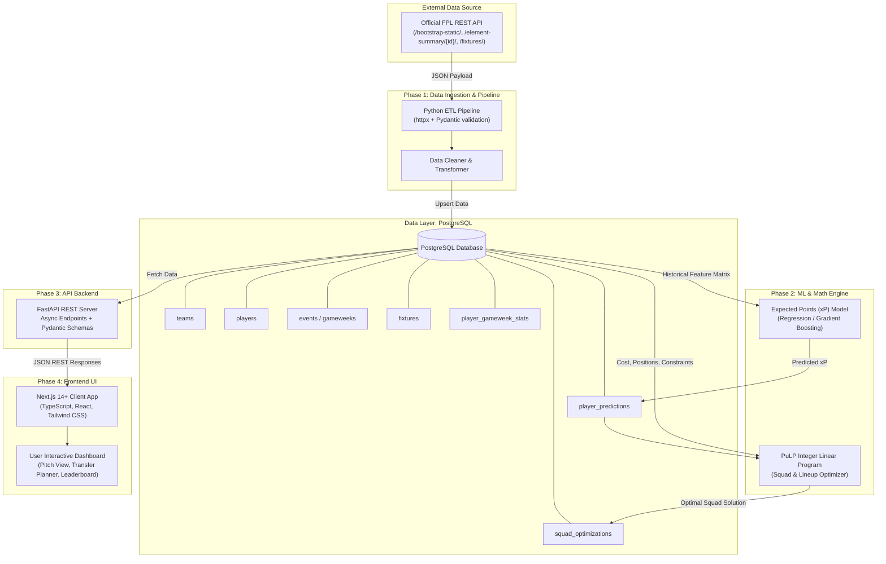
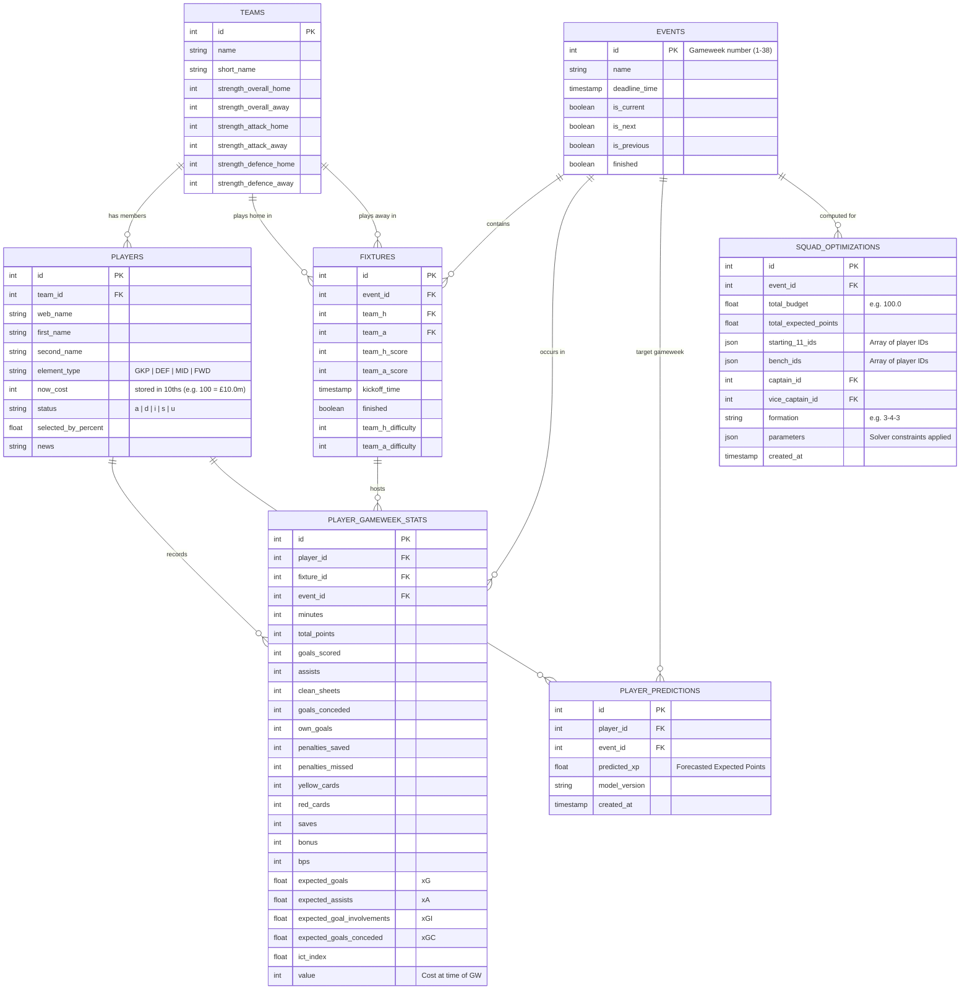
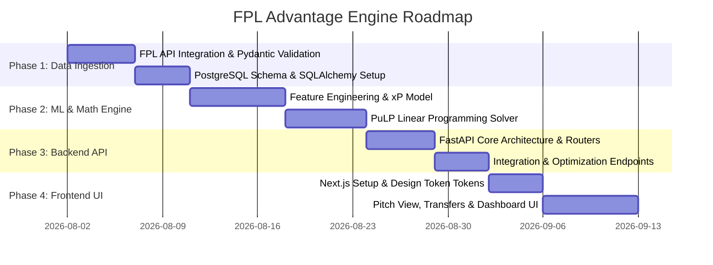

# FPL Advantage Engine: System Architecture & Blueprint

> **Role & Tone**: Lead Software Architect Mentorship Document  
> **Target Audience**: Junior Developer / Engineering Team  
> **Project**: FPL Advantage Engine (Fantasy Premier League AI Assistant & Squad Optimizer)  
> **Status**: Approved Architectural "North Star" Document  

---

## 1. Welcome & High-Level System Overview

Welcome to the **FPL Advantage Engine** project! As your Lead Architect, I'm thrilled to guide you through building this production-grade, data-driven Fantasy Premier League (FPL) decision engine.

Fantasy Premier League is a game of probability, statistics, and constrained optimization. Millions of managers compete based on player form, fixture difficulty, expected stats ($xG$, $xA$, $xGI$), and budget management. Our system will ingest raw FPL data, process historical performance metrics, run machine learning models to forecast **Expected Points ($xP$)**, solve integer linear programming problems to compute **Optimal Squad Selections**, and serve these insights via a sleek, modern dashboard.

### Tech Stack Summary
- **Data Ingestion & Pipeline**: Python 3.11+, `httpx` / `aiohttp`, `pydantic` (Data Validation)
- **Database & Persistence**: PostgreSQL 15+ with `SQLAlchemy 2.0` (Async ORM) & `Alembic` (Database Migrations)
- **Machine Learning & Optimization**: `scikit-learn` / `XGBoost`, `PuLP` (Linear Programming Solver), `pandas` / `numpy`
- **Backend API Layer**: `FastAPI`, `uvicorn`, `pydantic-settings`
- **Frontend Dashboard**: Next.js 14+ (App Router, TypeScript), React, Tailwind CSS / Custom Glassmorphic Styling, `Lucide React`, `Recharts`

---

### End-to-End Data Flow Architecture

The system flows through **5 distinct stages**: Data Acquisition, Processing & Persistence, Analytics & ML Forecasting, Mathematical Optimization, and Presentation.



---

## 2. Core PostgreSQL Database Schema

To maintain strong integrity, query efficiency, and seamless ORM mapping, we design a normalized relational schema in PostgreSQL.

### Entity Relationship Diagram (ERD)



---

### SQL DDL Specification

Below is the production DDL script defining our tables, primary keys, foreign keys, indexes, and check constraints.

```sql
-- Enums for Position Types
CREATE TYPE element_position_enum AS ENUM ('GKP', 'DEF', 'MID', 'FWD');

-- 1. TEAMS TABLE
CREATE TABLE teams (
    id INT PRIMARY KEY,
    name VARCHAR(100) NOT NULL,
    short_name VARCHAR(10) NOT NULL,
    strength_overall_home INT DEFAULT 0,
    strength_overall_away INT DEFAULT 0,
    strength_attack_home INT DEFAULT 0,
    strength_attack_away INT DEFAULT 0,
    strength_defence_home INT DEFAULT 0,
    strength_defence_away INT DEFAULT 0,
    created_at TIMESTAMP WITH TIME ZONE DEFAULT CURRENT_TIMESTAMP,
    updated_at TIMESTAMP WITH TIME ZONE DEFAULT CURRENT_TIMESTAMP
);

-- 2. EVENTS (GAMEWEEKS) TABLE
CREATE TABLE events (
    id INT PRIMARY KEY, -- Gameweek 1-38
    name VARCHAR(50) NOT NULL,
    deadline_time TIMESTAMP WITH TIME ZONE NOT NULL,
    is_current BOOLEAN DEFAULT FALSE,
    is_next BOOLEAN DEFAULT FALSE,
    is_previous BOOLEAN DEFAULT FALSE,
    finished BOOLEAN DEFAULT FALSE,
    created_at TIMESTAMP WITH TIME ZONE DEFAULT CURRENT_TIMESTAMP,
    updated_at TIMESTAMP WITH TIME ZONE DEFAULT CURRENT_TIMESTAMP
);

-- 3. PLAYERS (ELEMENTS) TABLE
CREATE TABLE players (
    id INT PRIMARY KEY,
    team_id INT NOT NULL REFERENCES teams(id) ON DELETE CASCADE,
    web_name VARCHAR(100) NOT NULL,
    first_name VARCHAR(100),
    second_name VARCHAR(100),
    element_type element_position_enum NOT NULL,
    now_cost INT NOT NULL, -- e.g., 100 represents £10.0m
    status VARCHAR(10) DEFAULT 'a', -- 'a'=available, 'd'=doubtful, 'i'=injured, 's'=suspended
    selected_by_percent NUMERIC(5, 2) DEFAULT 0.0,
    news TEXT,
    created_at TIMESTAMP WITH TIME ZONE DEFAULT CURRENT_TIMESTAMP,
    updated_at TIMESTAMP WITH TIME ZONE DEFAULT CURRENT_TIMESTAMP
);

CREATE INDEX idx_players_team ON players(team_id);
CREATE INDEX idx_players_element_type ON players(element_type);
CREATE INDEX idx_players_now_cost ON players(now_cost);

-- 4. FIXTURES TABLE
CREATE TABLE fixtures (
    id INT PRIMARY KEY,
    event_id INT REFERENCES events(id) ON DELETE SET NULL,
    team_h INT NOT NULL REFERENCES teams(id),
    team_a INT NOT NULL REFERENCES teams(id),
    team_h_score INT,
    team_a_score INT,
    kickoff_time TIMESTAMP WITH TIME ZONE,
    finished BOOLEAN DEFAULT FALSE,
    team_h_difficulty INT DEFAULT 3,
    team_a_difficulty INT DEFAULT 3,
    created_at TIMESTAMP WITH TIME ZONE DEFAULT CURRENT_TIMESTAMP,
    updated_at TIMESTAMP WITH TIME ZONE DEFAULT CURRENT_TIMESTAMP
);

CREATE INDEX idx_fixtures_event ON fixtures(event_id);
CREATE INDEX idx_fixtures_teams ON fixtures(team_h, team_a);

-- 5. HISTORICAL GAMEWEEK STATS TABLE
CREATE TABLE player_gameweek_stats (
    id SERIAL PRIMARY KEY,
    player_id INT NOT NULL REFERENCES players(id) ON DELETE CASCADE,
    fixture_id INT NOT NULL REFERENCES fixtures(id) ON DELETE CASCADE,
    event_id INT NOT NULL REFERENCES events(id) ON DELETE CASCADE,
    minutes INT DEFAULT 0,
    total_points INT DEFAULT 0,
    goals_scored INT DEFAULT 0,
    assists INT DEFAULT 0,
    clean_sheets INT DEFAULT 0,
    goals_conceded INT DEFAULT 0,
    own_goals INT DEFAULT 0,
    penalties_saved INT DEFAULT 0,
    penalties_missed INT DEFAULT 0,
    yellow_cards INT DEFAULT 0,
    red_cards INT DEFAULT 0,
    saves INT DEFAULT 0,
    bonus INT DEFAULT 0,
    bps INT DEFAULT 0,
    expected_goals NUMERIC(5, 2) DEFAULT 0.00,
    expected_assists NUMERIC(5, 2) DEFAULT 0.00,
    expected_goal_involvements NUMERIC(5, 2) DEFAULT 0.00,
    expected_goals_conceded NUMERIC(5, 2) DEFAULT 0.00,
    ict_index NUMERIC(6, 1) DEFAULT 0.0,
    value INT NOT NULL,
    CONSTRAINT uq_player_event UNIQUE (player_id, event_id, fixture_id)
);

CREATE INDEX idx_pgs_player_event ON player_gameweek_stats(player_id, event_id);
CREATE INDEX idx_pgs_event ON player_gameweek_stats(event_id);

-- 6. PLAYER PREDICTIONS TABLE
CREATE TABLE player_predictions (
    id SERIAL PRIMARY KEY,
    player_id INT NOT NULL REFERENCES players(id) ON DELETE CASCADE,
    event_id INT NOT NULL REFERENCES events(id) ON DELETE CASCADE,
    predicted_xp NUMERIC(5, 2) NOT NULL,
    model_version VARCHAR(50) NOT NULL,
    created_at TIMESTAMP WITH TIME ZONE DEFAULT CURRENT_TIMESTAMP,
    CONSTRAINT uq_player_prediction UNIQUE (player_id, event_id, model_version)
);

CREATE INDEX idx_predictions_event_xp ON player_predictions(event_id, predicted_xp DESC);

-- 7. SQUAD OPTIMIZATIONS TABLE
CREATE TABLE squad_optimizations (
    id SERIAL PRIMARY KEY,
    event_id INT NOT NULL REFERENCES events(id) ON DELETE CASCADE,
    total_budget NUMERIC(5, 1) NOT NULL DEFAULT 100.0,
    total_expected_points NUMERIC(6, 2) NOT NULL,
    starting_11_ids JSONB NOT NULL,
    bench_ids JSONB NOT NULL,
    captain_id INT NOT NULL REFERENCES players(id),
    vice_captain_id INT NOT NULL REFERENCES players(id),
    formation VARCHAR(10) NOT NULL,
    parameters JSONB,
    created_at TIMESTAMP WITH TIME ZONE DEFAULT CURRENT_TIMESTAMP
);

CREATE INDEX idx_optimizations_event ON squad_optimizations(event_id);
```

---

## 3. Strict 4-Phase Development Roadmap

To ensure modularity, high code quality, and maintainability, our development is structured into 4 sequential phases.



---

### Phase 1: Data Ingestion & ETL Pipeline

#### 1. Objectives
- Connect to official FPL REST endpoints asynchronously.
- Parse, validate, and clean raw data using Pydantic models.
- Store structured data into PostgreSQL using async SQLAlchemy upserts (`ON CONFLICT DO UPDATE`).

#### 2. Key FPL API Endpoints
1. `https://fantasy.premierleague.com/api/bootstrap-static/`
   - Returns core data: `elements` (players), `element_types` (positions), `teams`, and `events` (gameweek metadata).
2. `https://fantasy.premierleague.com/api/fixtures/`
   - Returns all 380 fixtures for the season with home/away difficulty ratings and scores.
3. `https://fantasy.premierleague.com/api/element-summary/{element_id}/`
   - Returns detailed past gameweek performance statistics for a specific player (xG, xA, ICT index, minutes, bonus, etc.).

#### 3. Architecture Blueprint for Data Pipeline
- **HTTP Client**: `httpx.AsyncClient` with custom retry handlers (backoff algorithm) to avoid FPL rate limits.
- **Data Validation**: Strict Pydantic models mapping camelCase or snake_case raw fields to validated types.
- **Upsert Execution**: Database transactions wrapped in SQLAlchemy session managers, guaranteeing zero partial updates.

---

### Phase 2: Machine Learning & Mathematical Optimization

#### 1. Expected Points ($xP$) Forecasting Model
The $xP$ model predicts a player's likelihood of scoring points in upcoming gameweeks based on historical features.

**Formula Overview**:
$$\text{Predicted } xP_{i, g} = f\Big(\text{xG}_{i}, \text{xA}_{i}, \text{Minutes}_{i}, \text{FixtureDifficulty}_{g}, \text{HomeAwayPreference}_{i}, \text{TeamForm}_{i}\Big)$$

**Key Features**:
- Rolling 5-gameweek weighted moving average for Expected Goals ($xG$) and Expected Assists ($xA$).
- Opponent Defensive/Attacking Strength (Home vs. Away adjustment).
- Player availability indicator ($status = 'a'$ vs injuries/suspensions).
- Historical appearance odds (probability of playing $\ge 60$ minutes).

#### 2. Integer Linear Programming (ILP) Squad Optimizer via PuLP
Selecting the highest-yielding 15-player squad (and starting 11) is a classic **Knapsack Problem / Binary Integer Programming Problem**.

**Mathematical Model Formulation**:

Let $i \in \{1, 2, \dots, N\}$ be the set of available players.  
Let $x_i \in \{0, 1\}$ denote whether player $i$ is selected in the starting 11.  
Let $y_i \in \{0, 1\}$ denote whether player $i$ is selected on the bench.  
Let $c_i \in \{0, 1\}$ denote whether player $i$ is designated as Captain.  
Let $p_i$ be the predicted expected points ($xP_i$) for player $i$.  
Let $v_i$ be the cost of player $i$.  
Let $T(i)$ be the team ID of player $i$, and $Pos(i)$ be the position (GKP, DEF, MID, FWD) of player $i$.

**Objective Function**:
$$\max \sum_{i=1}^{N} \Big( p_i \cdot x_i + 0.1 \cdot p_i \cdot y_i + p_i \cdot c_i \Big)$$
*(Note: Captain gets $2\times$ points, hence the extra $p_i \cdot c_i$. Bench players carry a low weight $0.1$ to encourage strong bench depth without sacrificing starting 11).*

**Constraints**:
1. **Total Squad Size**:
   $$\sum_{i=1}^{N} (x_i + y_i) = 15$$
2. **Starting 11 Size**:
   $$\sum_{i=1}^{N} x_i = 11$$
3. **Total Budget (e.g. £100.0m)**:
   $$\sum_{i=1}^{N} v_i \cdot (x_i + y_i) \le 1000 \quad \text{(costs stored in 10ths)}$$
4. **Position Breakdown (15 Squad)**:
   $$\sum_{i: Pos(i)=\text{'GKP'}} (x_i + y_i) = 2, \quad \sum_{i: Pos(i)=\text{'DEF'}} (x_i + y_i) = 5$$
   $$\sum_{i: Pos(i)=\text{'MID'}} (x_i + y_i) = 5, \quad \sum_{i: Pos(i)=\text{'FWD'}} (x_i + y_i) = 3$$
5. **Valid Starting 11 Formations**:
   $$\sum_{i: Pos(i)=\text{'GKP'}} x_i = 1$$
   $$3 \le \sum_{i: Pos(i)=\text{'DEF'}} x_i \le 5$$
   $$2 \le \sum_{i: Pos(i)=\text{'MID'}} x_i \le 5$$
   $$1 \le \sum_{i: Pos(i)=\text{'FWD'}} x_i \le 3$$
6. **Max 3 Players Per Team**:
   $$\forall k \in \text{Teams}, \quad \sum_{i: T(i)=k} (x_i + y_i) \le 3$$
7. **Captain Choice Constraint**:
   $$\sum_{i=1}^{N} c_i = 1 \quad \text{and} \quad c_i \le x_i \quad \forall i$$

---

### Phase 3: The API Backend (FastAPI)

The backend provides a clean RESTful interface over our database models, machine learning inference engine, and optimization solver.

#### Core Endpoint Architecture

| Method | Endpoint Path | Description | Query / Body Params |
| :--- | :--- | :--- | :--- |
| `GET` | `/api/v1/health` | System health check & DB connectivity status | None |
| `GET` | `/api/v1/events/current` | Get active gameweek info & deadline | None |
| `GET` | `/api/v1/players` | Filterable list of players with season stats | `team_id`, `position`, `max_cost`, `sort_by` |
| `GET` | `/api/v1/players/{id}` | Detailed player profile, historical stats & xP | `include_history=true` |
| `GET` | `/api/v1/fixtures` | Fixtures for gameweek with FDR ratings | `event_id` |
| `GET` | `/api/v1/predictions` | Leaderboard of top predicted players for GW | `event_id`, `position`, `limit` |
| `POST` | `/api/v1/optimize` | Triggers PuLP optimization engine | `{ budget: 100.0, target_event: 2, locked_player_ids: [], excluded_player_ids: [] }` |
| `POST` | `/api/v1/etl/trigger` | Triggers raw data pipeline refresh | Admin auth key |

---

### Phase 4: The Next.js Frontend Dashboard

The frontend presents sophisticated data insights through an intuitive UI.

#### UI Components & Key Screens
1. **Interactive FPL Pitch View**: Visual layout of the optimal 11 starting players + 4 bench players on a soccer pitch.
2. **Transfer Planner & Optimization Control Panel**: Sliders for budget, lock/exclude player toggles, and "Run AI Optimizer" trigger button.
3. **Fixture Difficulty Matrix (FDR Grid)**: Color-coded heatmaps (Green to Dark Red) evaluating upcoming fixture runs for all 20 teams.
4. **$xP$ Predictions Leaderboard**: Data table with sorting, search, filtering by position, cost, and team.

#### Visual Design Tokens & Aesthetic Standard
- **Theme**: Dark Mode First (Sleek slate background `#0F172A`, rich emerald accents `#10B981`, electric violet highlights `#8B5CF6`).
- **Styling**: Glassmorphism cards with border glow, smooth CSS transitions (`transition-all duration-300`).
- **Typography**: Google Font `Inter` or `Outfit` for modern numerical clarity.

---

## 4. Next Steps & Execution Workflow

Now that our architectural foundation is established:

1. Keep this `ARCHITECTURE.md` file as our primary reference document.
2. When starting **Phase 1**, we will incrementally construct project directories, Python dependencies, database connection modules, Pydantic schemas, and ETL ingestion scripts.
3. Always verify each component with unit/integration testing before moving to subsequent phases.

*Architect Note: Let's build step-by-step, clean, robust, and elegant.*
